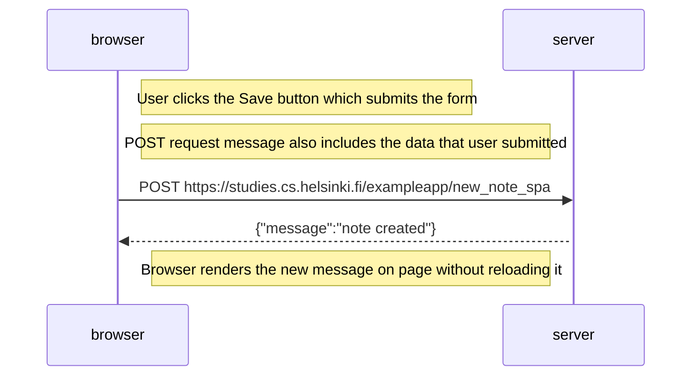

```mermaid
sequenceDiagram
    participant browser
    participant server

    Note right of browser: User clicks the Save button which submits the form 
    Note right of browser: POST request message also includes the data that user submitted

    browser->>server: POST https://studies.cs.helsinki.fi/exampleapp/new_note_spa
    activate server
    server-->>browser: {"message":"note created"}
    Note left of server: Browser renders the new message on page without reloading it

```